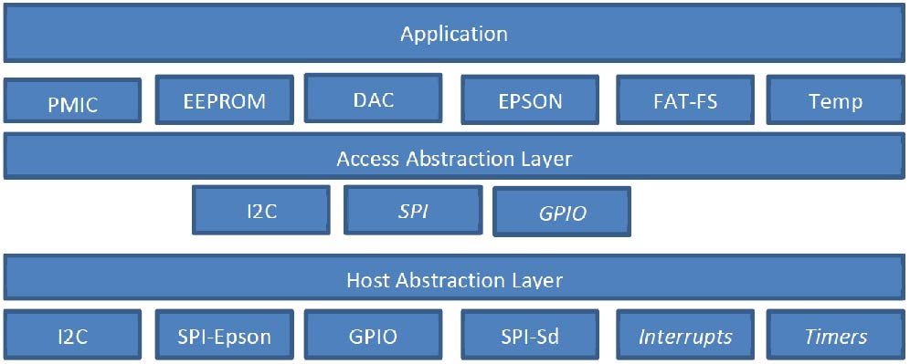

Code Structure
==============

Overview
--------
The diagram below shows an overview of the code base.

Things to note are:

1. The application sits right on top of the common components. There is no layer that abstracts a complete display system that can be manipulated by calling methods on it. 
2. The Host abstraction layer allows for porting to different CPU’s, either members of the same family or different architectures. Interrupts and Timers are not mandatory for the sample code to work.
3. There is an “Access Abstraction Layer”. This exists because the Epson controllers contain a number of resources, e.g. I2C master, SPI master, and on chip GPIO’s that the Application layer may want to use. This abstraction layer allows the application to access either a host CPU resource or one contained in the Epson controller without needing to know its location once initialised. Currently only support for I2C is implemented.

Platform Neutral Components
---------------------------
File System
^^^^^^^^^^^
The micro SD card uses a FAT/FAT16 file system for data storage (not FAT-32). In order to minimise code
and data size the FatFs driver is configured to support Read-Only operations, to reuse memory aggressively
and not to support long filenames. This has some small impact on access time and transfer speed for the
data within files.

Long filenames can be used when writing files to the SD card from a PC however the FatFs code can only
use the 8.3 compatible filenames. These names can be displayed under Windows by entering “DIR /X” e.g.:

 21/05/2011 07:01 8,863,336 NVWGF2~1.DLL nvwgf2umx.dll

+----------------------------------------+-------------------------------------------------------+
| SD Card path                           | Contents                                              |
+========================================+=======================================================+
| 0:/<display-type>                      | Root of the subtree for the selected display type     |
+----------------------------------------+-------------------------------------------------------+
| 0:/<display-type>/bin/Ecode.bin        | Epson controller initialisation file for display type |
+----------------------------------------+-------------------------------------------------------+
| 0:/<display-type>/img/\*.pgm           | Image files to be displayed                           |
+----------------------------------------+-------------------------------------------------------+
| 0:/<display-type>/img/slides.txt       | Optional sequence file                                |
+----------------------------------------+-------------------------------------------------------+
| 0:/<display-type>/display/vcom         | VCOM voltage for display                              |
+----------------------------------------+-------------------------------------------------------+
| 0:/<display-type>/display/waveform.bin | Waveform for the display (S1D13541)                   |
+----------------------------------------+-------------------------------------------------------+
| 0:/<display-type>/display/waveform.wbf | Waveform for the display (S1D13524)                   |
+----------------------------------------+-------------------------------------------------------+

Note: The VCOM and waveform data for each display should be stored on the display's EEPROM where applicable
(Type 19 displays have no EEPROM). The Plastic Logic reference code uses the data stored on the EEPROM by
default and will search on the SD card if the EEPROM does not contain valid data. This behaviour can be changed by modifying the ``CONFIG_DISP_DATA_xxx`` pre-processor definitions in
the config header file (``config.h``). For the best results, it is advisable to use the EEPROM-based data as this is tuned for each display.

EPDC API and Epson implementations
^^^^^^^^^^^^^^^^^^^^^^^^^^^^^^^^^^

The ``<pl/epdc.h>`` header file defines an abstract interface to an E-Paper
Display Controller implementation.  There are currently two Epson
implementations (S1D13524 and S1D13541), which internally share some overlap.
This will generate the appropriate SPI data transfers and control various GPIOs
to operate the EPDC.

Utility functions provide higher level functions on top of command transfer
layer. These functions support initialisation code and waveform loading, frame
buffer RAM fill, image data transfer and power state transition control.

It is worth noting that Epson name the SPI data signals with respect to the
controller. Hence DI (DataIn) => MOSI, and DO(DataOut) => MISO.

To prepare the controller for operation it is necessary to send two files to it:

1. A controller initialisation file which customises the controller's behaviour
   to the type of display it is going to drive, e.g. resolution, driver
   configuration, clock timings.
2. A waveform data file which provides display specific timing information
   required to maximise the performance and image quality of a display.

Epson S1D135xx I2C Interface
^^^^^^^^^^^^^^^^^^^^^^^^^^^^
The Epson controllers provide an SPI to I2C bridge that can be used to communicate with I2C peripherals
instead of using an I2C interface on the host processor. The I2C interface abstraction defined in i2c.h allows
higher level software to communicate using either method once an interface has been initialised.

The bridge results in a slower overall I2C data rate than a host I2C interface would achieve due to the
overhead of communicating over SPI to manage the transfer. However, in normal use the amount of I2C
traffic is limited to one-time device configuration.

Note that some peripherals, the MAXIM 17135 PMIC specifically, have inbuilt timeouts which can be
triggered when Epson command tracing is taking place and the Epson I2C bridge is in use.

Temperature Measurement
^^^^^^^^^^^^^^^^^^^^^^^
The accurate measurement of temperature is important to obtaining the best image quality from the
display. The temperature is used to select the correct waveform used to drive the display. It is common for
display updates to take longer at lower temperatures due to the physical attributes of the display media.
The S1D13524 and S1D13541 have differing methods of handling temperature measurement. These are exposed in the
code as “modes”:

1. Manual – The application software will obtain the temperature from some other component, e.g. the PMIC and pass it to the controller.
2. Internal – The display controller will use its built-in temperature sensor, if it has one, to measure the temperature. The S1D13541 controller contains such a temperature sensor, which requires an external NTC thermistor to be fitted (as shown on the Z6 and Z7 reference schematics).
3. External – The display controller will communicate directly with an LM75-compatible I2C temperature sensor to obtain the temperature.

To trigger the acquisition or processing of temperature data the controller's measure _temperature()
function is called. On completion a new temperature will be in effect. On the S1D13541 controller an indication
that the waveform data must be reloaded is given if the temperature measured has moved outside the
range of the currently cached waveform data.

Currently the Internal mode is implemented for the S1D13541 and the External mode is implemented for the S1D13524. The code contains appropriate hooks for implementing the Manual mode if required.

VCOM Calibration
^^^^^^^^^^^^^^^^
The accurate setting of the VCOM voltage is essential to obtaining the best image quality from the display.
Each display has associated with it a VCOM voltage that must be used – specified in millivolts. In order to
translate from mV to the required VCOM DAC value a software component takes the requested VCOM
value and the power supply calibration information and returns a value to be written to the DAC register.
The calibration data is determined by measuring a sample of power supplies using a defined calibration
procedure. The output of the calibration procedure must be made available to the VCOM software module
when it is initialised (See ``vcom_init()`` in the ``vcom.c`` source file). The display interface boards either store this data in an EEPROM on the board or it is
measured once and stored in the code.

The VCOM calibration procedure is described in the document “Electronics for small displays” available
from Plastic Logic.

Putting it all Together
^^^^^^^^^^^^^^^^^^^^^^^

The source code contains examples of how to drive a number of different display
interface boards.

The ``main.c`` file contains hardware definitions and the ``main_init``
function which goes through a top-level initialisation sequence.  This is
common to all Plastic Logic reference hardware combinations.  It calls
functions in ``probe.c`` to determine any run-time configuration and initialise
the software and hardware accordingly.

When porting to a specific product design, typically the ``main_init`` function
and associated hardware definitions (i.e. GPIOs) would be tailored to only take
care of the hardware features available on the product.  The ``probe.c``
functions are here mainly for run-time dynamic configuration, which may not be
applicable to a fixed and optimised product so initialisation function calls
may be typically be picked from ``probe.c`` and called directly in
``main_init``.

Host Abstraction Layer
----------------------
The host abstraction layer isolates the platform neutral code from the underlying platform hardware. The
abstraction layers are kept as self-contained and thin as practical. While interrupts and timers are listed
their availability is not required to create a working system.

Host GPIO Interface
^^^^^^^^^^^^^^^^^^^
The GPIO interface provides a way to reserve and define a GPIO pin on the host processor at run time. On
small microcontrollers pins are typically either GPIO’s or connected to a single special purpose hardware
unit e.g. an I2C unit. Some, or all, of the GPIO’s supported may be able to generate interrupts.

The GPIO interface records which GPIO’s are already defined but not the mode in which they are
configured. This allows the code to trap errors where a pin is defined multiple times, or used before being
defined. GPIO pins are typically used to control the power sequence hardware and manipulate signals in
the serial and parallel interface to the Epson controller.

Host I2C Interface
^^^^^^^^^^^^^^^^^^
The host I2C interface provides access to an I2C interface physically attached to the host processor. Only a
single I2C interface is supported by the code. A host I2C interface may not be required if the system is
configured to use the Epson SPI-I2C bridge feature instead.

Examples of devices connected to I2C include the HVPMIC, temperature sensors, and EEPROMs.

Host SPI Interface – Epson
^^^^^^^^^^^^^^^^^^^^^^^^^^
The host SPI-Epson interface provides access to an SPI interface that is connected to the Epson controller
when it is operating in serial interface mode. On short cables this interface has been operated at 20MHz
successfully. In general the Epson controller should be placed on its own SPI bus due to the need to keep
the chip selected for the entire duration of the image data transfer operation which may be up to 1MB.

Host SPI Interface – SD Card
^^^^^^^^^^^^^^^^^^^^^^^^^^^^
The host SPI-SDCard interface provides access to an SPI interface that is connected to the SD Card. The SD
Card is operated at 20MHz. If additional hardware is available in the host processor the SD Card could be
operated in 4 bit parallel mode for improved data transfer speed.

Host Interrupt Interface
^^^^^^^^^^^^^^^^^^^^^^^^
The interrupt interface supports the processing of interrupts. The code currently does not use interrupts
but the first usage will be for notifying the code that the Epson is ready to accept a new command by the
assertion of the HRDY line.
The abstraction is still to be defined

Host Timer Interface
^^^^^^^^^^^^^^^^^^^^
The timer interface provides platform specific timer implementations. Currently delays are coded as busy
loops. A more power efficient mechanism will follow in a future release.

MSP430 Specific Host Interfaces
-------------------------------

GPIO Interface
^^^^^^^^^^^^^^

This is the reference implementation for the GPIO host interface and can be
found in ``msp430-gpio.c``. It supports the configuration of all features on all
pins that can be configured. It is only possible to configure one pin at a time
in a port. It is not possible to define the configuration of multiple pins in a
port with one call – e.g. when defining an 8 bit bus as output or input. The
code attempts to verify the request as much as it can. Much of the error
checking code can be disabled once the porting process to a new platform has
been completed and the platform configuration is stable.

I2C Interface
^^^^^^^^^^^^^

A single i2c interface is supported. I2C is only supported in UCSB modules and
the chosen UCSB module is defined in the ``msp430-i2c.c`` source file by setting
the macros “USCI_UNIT” and “USCI_CHAN” as required.  The code will then
reconfigure itself to reference the correct I2C unit. In addition to specifying
which UCSI module to use the I2C SDA and SCL pins need to be connected to the
USCI unit by defining the appropriate pins as PIN_SPECIAL in the gpio_request()
call.

SPI Interface – Epson
^^^^^^^^^^^^^^^^^^^^^

SPI is supported in both USCI_A and USCI_B modules and the chosen USCI module
is defined in the ``msp430-spi.c`` source file by setting the macros “USCI_UNIT”
and “USCI_CHAN” as required. The code will then reconfigure itself to reference
the correct SPI unit. In addition to specifying which USCI module to use the
SPI_CLK, SPI_MOSI and SPI_MISO pins need to be connected to the USCI unit by
defining the appropriate pins as PIN_SPECIAL in the gpio_request() call. Note
that it is possible to use both the USCI_A and USCI_B units. i.e. USCI_A0 and
USCI_B0 are physically different hardware units.

A single SPI interface is supported for Epson controller
communications. Multiple controllers can be connected to this bus and are
selected using their chip select lines as required. This interface runs at
20Mbps reliably. Due to the need to keep the Epson chip selected for the
duration of the image data transfer the Epson controller must be placed on a
separate bus to the SD card so that multiple blocks can be read from the SD
card.

SPI Interface – SD Card
^^^^^^^^^^^^^^^^^^^^^^^

SPI is supported in both USCI_A and USCI_B modules and the chosen USCI module
is defined in the ``msp430-sdcard.c`` source file by setting the macros “USCI_UNIT”
and “USCI_CHAN” as required. The code will then reconfigure itself to reference
the correct SPI unit. In addition to specifying which USCI module to use the
SPI_CLK, SPI_MOSI and SPI_MISO pins need to be connected to the USCI unit by
defining the appropriate pins as PIN_SPECIAL in the gpio_request() call. Note
that it is possible to use both the USCI_A and USCI_B units. i.e. USCI_A0 and
USCI_B0 are physically different hardware units.

A single SPI interface is supported for transferring data from the micro SD
card slot. This interface runs at 20Mbps reliably.

UART Interface
^^^^^^^^^^^^^^

A serial interface is supported using a pin header on the MSP430 board into
which can be plugged an FTDI active serial-to-USB cable. The code can be
configured to route all standard output to the serial port rather than back to
the debugger. This allows debug output still be seen when no debugger is
attached. To enable this feature, edit the relevant line in
``msp430/msp430-uart.c``:

.. code-block:: c

    // set to 1 to have stdout, stderr sent to serial port
    #define CONFIG_UART_PRINTF		0

Porting the Existing Code to a New MSP430 Processor
^^^^^^^^^^^^^^^^^^^^^^^^^^^^^^^^^^^^^^^^^^^^^^^^^^^

Porting the existing code to a design which requires a different pin out is
relatively straightforward.  The necessary configuration information is mainly
contained in the ``main.c`` file.

To reconfigure the reference code follow the sequence below:

1. Determine which USCI units will be used in the new configuration. Ensure the
   unit is suitable for its intended purpose
2. Determine which pins are associated with the chosen USCI units
3. Determine which pins will be used for the Epson SPI signals HRDY, HDC, and
   RESET
4. Determine which pin(s) will be used for the Epson SPI chip select
5. Determine which pins may be necessary to control the power supplies
6. In each of the msp430-spi.c, msp430-sdcard.c, msp430-i2c.c and msp430-uart.c

    a. Define USCI_UNIT and USCI_CHAN as required
    b. Modify the definitions for the pins so they match the chosen UCSI unit
    c. e.g.:

.. code-block:: c

    #define USCI_UNIT B
    #define USCI_CHAN 0
    // Pins from MSP430 connected to the SD Card
    #define SD_CS MSP430_GPIO(5,5)
    #define SD_SIMO MSP430_GPIO(3,1)
    #define SD_SOMI MSP430_GPIO(3,2)
    #define SD_CLK MSP430_GPIO(3,3)

7. In ``main.c``, define the Epson SPI interface signals, e.g.:

.. code-block:: c

    // Remaining Epson interface pins
    #define EPSON_HDC MSP430_GPIO(1,3)
    #define EPSON_HRDY MSP430_GPIO(2,7)
    #define EPSON_RESET MSP430_GPIO(5,0)

8. In ``main.c``, define the power control and Epson chip select pins, e.g.:

.. code-block:: c

    #define B_HWSW_CTRL MSP430_GPIO(1,2)
    #define B_POK MSP430_GPIO(1,0)
    #define B_PMIC_EN MSP430_GPIO(1,1)
    #define EPSON_CS_0 MSP430_GPIO(3,6)
	
Recompile the code and it has now been retargeted to the new pin assignments.

.. raw:: pdf
 
   PageBreak

