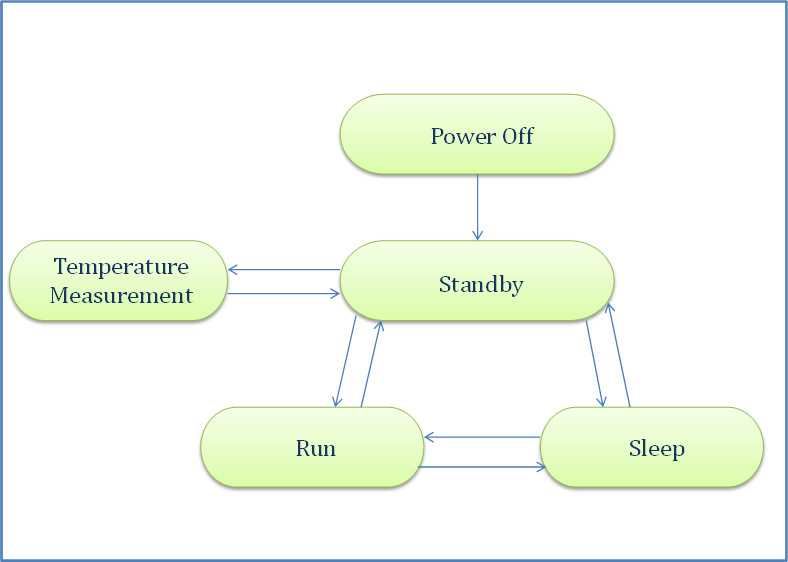

Supported Hardware
==================

Hardware Components
-------------------
This section lists the hardware components commonly found on boards intended to drive Plastic Logic
displays that require software drivers.

Maxim 5820 DAC
^^^^^^^^^^^^^^
The 5820 DAC is a general purpose I2C 8bit DAC used to set the VCOM voltage on some boards. It can be
turned off to save power. The need for an external DAC has largely been removed from new designs by the
ability to use the VCOM DAC provided in the PMIC instead.

Microchip EEPROMs
^^^^^^^^^^^^^^^^^
The code supports I2C EEPROMs up to 64KB in size. The code currently supports two I2C EEPROM types:

1. **24LC014** – this is a small 128B EEPROM fitted to later display interface boards and is used to store power supply calibration data. This permits accurate VCOM voltages to be achieved when the display interface board is swapped. It also stores other hardware configuration information.
2. **24AA256** – this is a 32KB EEPROM found on some display types. It is intended to store waveform information so that the necessary information to drive a display travels with the display. This allows the system to ensure the correct waveform information is used for the display. Since waveforms can exceed 32KB in size, the data stored on this EEPROM is compressed using the LZSS compression algorithm.

EEPROM types can be added by extending the table that defines the device characteristics (in ``i2c-eeprom.c``) and extending the enumeration of EEPROM types (in ``i2c-eeprom.h``).

LM75 Temperature Sensor
^^^^^^^^^^^^^^^^^^^^^^^
The LM75 temperature sensor is a configurable I2C temperature sensor that can measure temperature
autonomously at programmable intervals. It can be used when the temperature measuring facilities of the
PMICs cannot be used for some reason.
The measured temperature register can be read automatically by the Epson controllers.

Maxim MAX17135 HVPMIC
^^^^^^^^^^^^^^^^^^^^^
The Maxim PMIC is used on boards primarily intended to drive the 10.7” displays. Its key features are:

- I2C interface for configuration of power sequence timings
- Hardware signals for PowerUp/Down, PowerGood and PowerFault
- I2C commands for PowerUp/Down and power supply monitoring
- Inbuilt 8bit VCOM DAC
- Inbuilt LM75 compatible temperature sensor with automatic temperature sensing

TI TPS65185 HVPMIC
^^^^^^^^^^^^^^^^^^
The TI PMIC is used on boards intended to drive the small displays. Its key features are:

- I2C interface for configuration of power sequence timings
- Hardware signals PowerUp/Down, PowerGood and PowerFault
- I2C commands for PowerUp/Down and power supply monitoring
- Inbuilt 9bit VCOM DAC
- Inbuilt LM75 compatible temperature sensor with on demand temperature sensing.

Epson Controllers
-----------------
Epson have a range of controllers designed to support the output of images onto electrophoretic displays
(EPD). The controllers differ in the size of display they can support, whether they have external or
internal frame buffer memory, on-board or external power supplies and support for colour displays.

The controllers can be accessed via SPI or a 16-bit parallel data bus.

In addition to the main EPD functionality the controllers contain a varying collection of useful hardware
units that may be required in a system fitted with an electrophoretic display. For example, an I2C master,
SPI master, GPIO ports, and internal temperature sensor.

Which options are available will ultimately depend on the controller selected and how it is connected to
the display and other system components.

The code supports the Epson **S1D13524** and **S1D13541** controllers in various configurations. The S1D13524
controller supports large (up to 4096x4096 pixels greyscale and colour) displays and is fitted to a circuit
board with its external SDRAM. The S1D13541 controller supports smaller displays (up to 854x480 pixels greyscale)
and is physically bonded to the display module.

Power State Management Epson S1D13541
^^^^^^^^^^^^^^^^^^^^^^^^^^^^^^^^^^^^^
The Epson S1D13541 controller can be configured to one of several power states; helping to minimise power use 
when appropriate. 

These power states are:

- Power Off
   - Clock chip disabled
   - 3V3 power to S1D13541 disabled
- Standby
   - Can be set from SLEEP or RUN mode
   - Clock chip enabled
   - Power save status bit set to 0
   - Source/gate driver powered off  
- Run 
   - Can be set from SLEEP or STANDBY mode
   - Clock chip enabled
   - Power save status bit set to 1
   - Source/gate driver powered on
- Sleep 
   - Can be set from RUN or STANDBY mode
   - Clock chip disabled
   - Source/gate driver powered off 
   - Power save status bit set to 0

The figure below shows the possible power state transitions.

Below is a breakdown of the actions that must be taken for each of the power state transitions.

Run -> Standby
**************

1. STBY command (CMD(0x04), no parameters) issued to Epson controller
2. Wait for HRDY = 1

Sleep -> Standby
****************

1. Set CLK_EN GPIO true to re-enable clock
2. Set REG[0x0006] bit 8 to 1 for normal power supply
3. STBY command (CMD(0x04), no parameters) issued to Epson controller
4. Wait for HRDY = 1

Run/Standby -> Sleep
********************

1. SLP command (CMD(0x05), no parameters) issued to Epson controller
2. Wait for HRDY = 1
3. Set REG[0x0006] bit 8 to 0 for minimum power supply
4. Set CLK_EN GPIO to false to disable clock

Standby -> Run
**************

1. RUN command (CMD(0x02), no parameters) issued to Epson controller
2. Wait for HRDY = 1

Sleep -> Run
************

1. Set CLK_EN GPIO to true to re-enable clock
2. Set REG[0x0006] bit 8 to 1 for normal power supply
3. RUN command (CMD(0x02), no parameters) issued to Epson controller
4. Wait for HRDY = 1

Run/Standby/Sleep -> Power Off
******************************

1. SLP command (CMD(0x05), no parameters) issued to Epson controller
2. Set CLK_EN GPIO to false to disable clock
3. Set 3V3_EN GPIO to false to disable 3V3 power supply

.. note::

 Any data in the image buffer will be lost when going into off mode. If the current displayed image
 is to be retained when powering back up, the contents of the image buffer should be copied to a suitable
 location (e.g. an SD card) before continuing with the power off. This image can then be loaded back into
 the image buffer when coming out of power off mode.

Power Off -> Standby
********************

.. note::

 After each of the following commands, the host should wait for HRDY to be 1 before continuing.

1. Set 3V3_EN GPIO to true to enable 3V3 power supply
2. Set CLK_EN GPIO to true to enable clock
3. INIT_CMD_SET command (CMD(0x00 + Epson Instruction Code Binaries)) issued to Epson controller
4. INIT_SYS_STBY command (CMD(0x06, no parameters) issued to Epson controller
5. Set Protect Key Code to REG[0x042C] and REG[0x042E]
6. BST_WR_MEM command (CMD(0x1D) + Waveform Storage Address) to start loading waveform data
7. WR_REG command (CMD(0x11), 0x154 + Waveform) to load waveform data
8. BST_END_MEM command (CMD(0x1E), no parameters) to end loading waveform data
9. RUN command (CMD(0x02), no parameters) issued to Epson controller
10. UPD_GDRV_CLR command (CMD(0x37), no parameters)
11. WAIT_DSPE_TRG command (CMD(0x28), no parameters)
12. S1D13541 is initialised into known state

The EPD Panel and Image Buffer should now be initialised to a known state; either the standard
white initialisation waveform, or image data copied to a safe medium before power off was called.

Power State Demo
****************

A power state demo can be launched using the Plastic Logic reference code by including the following in ``config.h``:

.. code-block:: c

   #define CONFIG_DEMO_POWERMODES 1

This demo will transition through the power states with the following behaviour:

- Go into RUN mode
- Load an image into the image buffer
- Update the display
- Go into SLEEP mode for 2 seconds
- Go into STANDBY mode for 2 seconds
- Go into RUN mode
- Update the display (with image data retained from the previous update)
- Go into POWER OFF mode (CLKI and 3V3 disabled) for 2 seconds
- Go through power on initialise

Plastic Logic Evaluation Hardware
---------------------------------
Display Types
^^^^^^^^^^^^^
The code supports the following Plastic Logic display types. Additional displays will be supported as
required.

+--------------+------------+------------------------------------------------------+
| Display Type | Resolution | Notes                                                |
+==============+============+======================================================+
| Type11       | 1280x960   | External Controller                                  |
|              |            |                                                      |
|              |            | Requires the Mercury display connector board         |
+--------------+------------+------------------------------------------------------+
| Type16       |  320x240   | Bonded Controller                                    |
|              |            |                                                      |
|              |            | 4.7" @85ppi, 2.7" @150ppi                            |
+--------------+------------+------------------------------------------------------+
| Type18       |  400x240   | Bonded Controller                                    |
|              |            |                                                      |
|              |            | 4.0" @115ppi                                         |
+--------------+------------+------------------------------------------------------+
| Type19       |  720x120   | Bonded Controller                                    |
|              |            |                                                      |
|              |            | 4.9" @150ppi                                         |
|              |            |                                                      |
|              |            | Requires pixel data to be reordered                  |
+--------------+------------+------------------------------------------------------+

Parrot - MSP430 Processor Board
^^^^^^^^^^^^^^^^^^^^^^^^^^^^^^^
The Parrot board docks with the Ruddock2 motherboard to provide access to the display interfaces. It has
the same form factor and connector pin out as a BeagleBone allowing the processors to be easily swapped
for evaluation or development work. The Parrot board can also be used without the Ruddock2 by connecting it directly to the Z6, Z7 or Raven boards via the 24-pin "serial" interface.

The board has the following features:

- MSP430F5438A, clocked at 20MHz
- A 32KHz oscillator for low power operation
- micro SD card socket
- On-board reset switch
- JTAG programming header (an adapter may be required to mate with the MSP-FET430UIF programmer)
- All 100 processor pins available on debug headers
- On-board power regulation and power socket (can also be powered from USB)
- The board has 1 LED for power good and another connected to a pin on the processor for status indication
- 24-pin "serial" interface to Z6, Z7 and Raven boards
- Provision for an SPI daisy-chain of MSP430 boards using 2 SPI channels (upstream and downstream)

Ruddock2
^^^^^^^^
The Ruddock2 board is a motherboard that sits between a processor board, currently either BeagleBone
or a microcontroller (MSP430) and the display interface board. It provides signal routing from the processor
to the interface connectors together with some LEDs and switches that can be used to configure the
software or create a user interface. The board allows the Epson serial, parallel and TFT interfaces to be
used depending on the interface board and controller selected. The processor board can disable all power
from the Ruddock2 under software control allowing hardware components, e.g. display interface boards, to
be safely exchanged. The board has a 128B EEPROM which can be used as non-volatile storage if required.

HB Z6/Z7
^^^^^^^^
The Z6 and Z7 are intended to drive a S1D13541 small display controller which is bonded to the display itself. The boards differ in the display connector used. The Z7 board is used to drive the Type19 bracelet display and the Z6 is used to drive all other Plastic Logic small displays. The boards have a TI PMIC and a 128B EEPROM for storing power supply calibration data. The VCOM DAC in the PMIC is used to set the VCOM value for the display. All versions of the Z7 board have the provision to turn off 3V3 power to the display controller; this feature is absent on version 6.1 of the Z6 but has been introduced as of version 6.3, along with the ability to control the clock enable and PMIC wake signals.

Raven
^^^^^
The Raven board is designed to drive 10.7” Type11 displays. The board has an Epson S1D13524
controller and associated memory, a Maxim PMIC, a 128B EEPROM for storing power supply calibration
data and an LM75 temperature sensor. The VCOM DAC in the PMIC is used to set the VCOM value for the
display.

The board has input connectors that allow it to be controlled via the Serial host interface (SPI) or Parallel
host interface. Additionally the signals to support data transfer using the TFT interface are available. The
board has 5 test pads which bring out the 5 Epson GPIO pins found on the S1D13524.

.. raw:: pdf

    PageBreak

